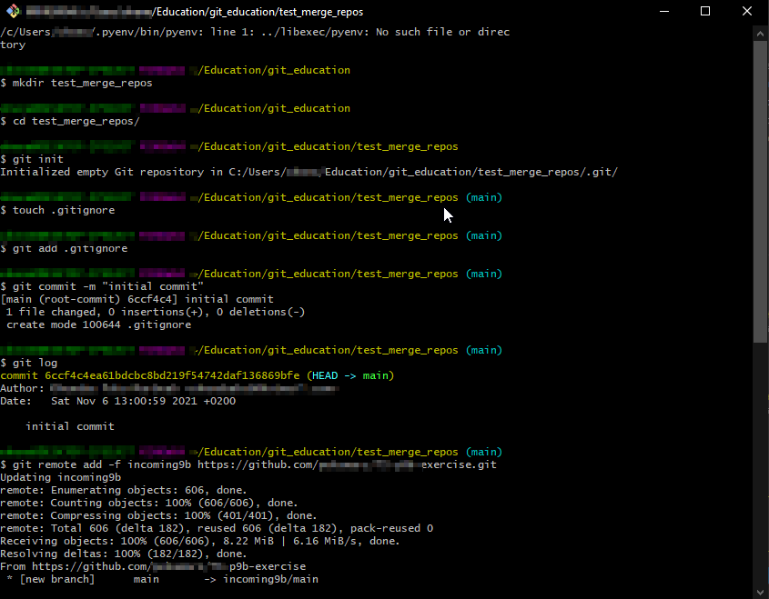

# How to combine multiple git repositories into one git repository
### preserving the commit history of all of them in the new repo

### Motivation
In order to submit all the exercises I did for the Helsinki University [full stack open Part 9 (Typescript)](https://fullstackopen.com/en/part9) I had to submit a git repo with all my exercises.

I forgot that it was one link to be submitted so I made several repos and did each separate portion of the exercises in them. This brings up the problem of how can I submit them in one link.

I can 
1. copy paste all the different portions into 1 directory and make that a git repo. That will mean I lose all my commit history and thus all the github green activity blocks would be lost (priorities eh XD).
2. Find some way of combining all the 4 repos into one git repo and keep that seet sweet git commit history (and grern activity blocks).

I went with option 2. It led me down a path of installing Perl and trying to use CPAN to install git-stitch-repo. That hit a dead-end  as soon as I got a 
`Error installing package 'git-stitch-repo': Could not locate a PPD file for package git-stitch-repo`

Since I am utterly unfamilar with the Perl ecosystem I just looked for other ways to do this.

The solution I used is [How to Import Multiple Projects into a Single Git Repository ](https://www.w3docs.com/snippets/git/how-to-import-multiple-projects-into-a-single-git-repository.html) by W3docs where they explain how to do it for 2 repos.
I dont really love the way they explained it so I have given some screenshots below to help better understand in case anyone ever needs this.

### NB
After you finish successfully and try to check the individual projects, you may encounter this error when you open any typescript file -
`Parsing error: Cannot read file 'c:\users\host_repo\tsconfig.json'.`
The solution to this is to modify the eslintrc of each project; change the parserOptions.project to "./project_directory/tsconfig.json" from "./tsconfig.json"
```js
  "parserOptions": {
    "project": "./incoming_backend_dir/tsconfig.json"
  }
  
  //For the React project this was what worked
  "parserOptions": {
    "project": "./tsconfig.json"
  }
  ```
  Alternatively consult this [Stack Overflow](https://stackoverflow.com/questions/64933543/parsing-error-cannot-read-file-tsconfig-json-eslint) thread for the relevant discussion and suggested solutions


<br><br><br>

## Example/commands
Basically, I repeat the same steps for all 4 repos I wanted to create in that same hosting (new) repository which I will then use for my submission link.

#### repo1
incoming9b 		- is the local name we have given to the remote directory that contains files from exercise 9b<br>
incoming9b_dir	- is the directory we want to save the incoming9b files into<br>

git remote add -f incoming9b github_url/[GITHUB_USERNAME]/first-repo-we-will-combine.git<br>
git merge -s ours --no-commit --allow-unrelated-histories incoming9b/main<br>
mkdir incoming9b_dir<br>
git read-tree --prefix=incoming9b_dir/ -u incoming9b/main<br>
git commit -m "Subtree merged in incoming9b_dir"<br>
git pull -s subtree incoming9b main<br>

#### repo2
incoming9c 		- is the local name we have given to the remote directory that contains files from exercise 9c<br>
incoming9c_dir	- is the directory we want to save the incoming9c files into<br>

git remote add -f incoming9c github_url/[GITHUB_USERNAME]/second-repo-we-will-combine.git<br>
git merge -s ours --no-commit --allow-unrelated-histories incoming9c/main<br>
mkdir incoming9c_dir<br>
git read-tree --prefix=incoming9c_dir/ -u incoming9c/main<br>
git commit -m "Subtree merged in incoming9c_dir"<br>
git pull -s subtree incoming9c main<br>

#### repo3
incoming9d 		- is the local name we have given to the remote directory that contains files from exercise 9d<br>
incoming9d_dir	- is the directory we want to save the incoming9d files into<br>

git remote add -f incoming9d github_url/[GITHUB_USERNAME]/third-repo-we-will-combine.git<br>
git merge -s ours --no-commit --allow-unrelated-histories incoming9d/main<br>
mkdir incoming9d_dir<br>
git read-tree --prefix=incoming9d_dir/ -u incoming9d/main<br>
git commit -m "Subtree merged in incoming9d_dir"<br>
git pull -s subtree incoming9d main<br>


<br><br><br>
## Screenshots

| fig1 Create host git repo and add repo 1 -part 1 | fig2 Create host git repo and add repo 1 -part 2|
|------------|-------------| 
| |  |

| fig3 add repo 2 to host repo   | fig4 add repo 3 & 4 to host repo  |
|------------|-------------| 
| |  |
